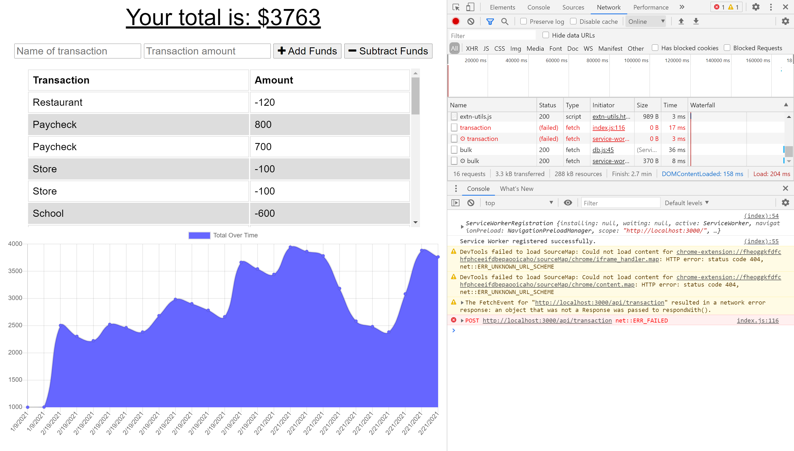

# Budget Trackers
Giving users a fast and easy way to track their money is important, but allowing them to access that information anytime is even more important. Having offline functionality is paramount to our applications success. The user will be able to add expenses and deposits to their budget with or without a connection. When entering transactions offline, they should populate the total when brought back online.

###  Budget Trackers contents:
* [User Story](#User-Story)
* [Images with application functionality](#Images-with-application-functionality)
* [Tech/framework used](#Tech/framework-used)
* [Installation](#Installation)
* [Project Link & Repository](#Project-Link-&-Repository)
* [Contributors](#Contributors)
* [License](#License)

### User Story
```
GIVEN a user is on Budget App without an internet connection
WHEN the user inputs a withdrawal or deposit
THEN that will be shown on the page, and added to their transaction history when their connection is back online.

```
### Images with application functionality:

|  |  |

### Tech/framework used:
* Node JS
* MongoDB
* Express
* Heroku
* Web Manifest
* Service Workers

### Installation  
* Copy repository on your local machine
* Create a `.gitignore` file and include `node_modules/`, `.DS_Store/` so that your `node_modules` isn't uploaded to GitHub. Be sure to create your `.gitignore` file before installing any npm dependencies.
* Run npm install  in your terminal to install all dependency
* Open new terminal window and run MongoDB instance.
* Run npm start - to start the app

### Project Link & Repository
- Heroku Link- (https://budgettrackerion.herokuapp.com/)
- Repository Link - (https://github.com/IonGavrilita/Budget_Tracker)

### Contributors
- Name: Ion Gavrilita
- Email: gavrilita.ion.93@gmail.com
- Github profile: https://github.com/IonGavrilita
### License
This project is licensed under MIT
[](https://opensource.org/licenses/MIT)

